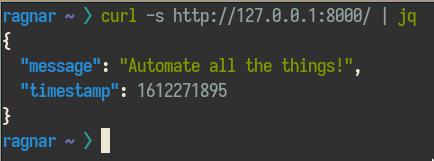

# Time Service API

Time Service API is a simple REST API to fetch the current time since epoch.

## Getting Started

### Tech Stack

* Python 3
* [Poetry](https://python-poetry.org/) (python dependecy manager)
* FastAPI
* Pydantic
* Uvicorn

### Running the project locally

There's a convenience script `run-locally.sh` which will install all project
dependencies and then run the project. It assumes Python 3.9

To install the project dependencies run `poetry install`.  
To run the project, run `poetry run uvicorn app.main.app --reload`

### Running the project locally using Docker

1. Run `docker build -t time-service:0.1.0` to build the image.
2. Run `docker run -it -p 8000:8000 --rm time-service:0.1.0`

### Validating the service is working

To test the service is working, you can use curl:

```
$ curl -s http://127.0.0.1:8000/ | jq
{
  "message": "Automate all the things!",
  "timestamp": 1612235363
}
```



### API Documentation

The project has an interactive API documentation based on [Swagger UI](https://swagger.io/tools/swagger-ui/).
To view the documentation open a browser at `http://127.0.0.1:8000/docs#/` with the application running.


### Kubernetes deployment
